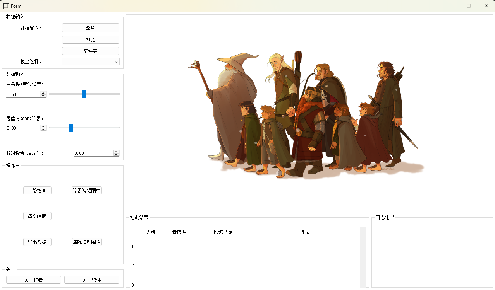

# Smart-Client
Visualization Tools

## 功能特点
- 支持多种输入源（图片、视频、文件夹、视频流等）
- 支持多种算法调用 （行人、车辆、渣土车检测、车牌识别、人脸识别等）
- 实时显示视频画面
- 一键截图保存
- 简洁的用户界面

## 安装依赖

```bash
pip install -r requirements.txt
```

## 运行程序

```bash
python app.py
```

## 代码结构
```plaintext
project/
│── main.py               # 程序入口
│── ui/
│    └── mainwindow.ui    # 由QtDesigner生成
│── view/
│    └── mainwindow.py    # PyUIC 转换的 UI 类（UI 层）
│── controller/
│    └── main_controller.py   # 业务逻辑控制层
│── model/
│    └── ai_inference.py      # AI算法封装（推理模型）
│    └── video_stream.py      # 数据源（摄像头/视频流）
│── resources/
│    └── icons/ ...           # 图标、背景等
```


## 使用说明

1. 在输入框中选择视频源地址
2. 在模型选择框中选中模型选项
3. 点击"开始检测"按钮开始显示视频
3. 点击"导出数据"按钮保存当前帧和检测结果
4. 点击"停止检测"按钮停止视频显示

## 注意事项

- 确保视频流地址可访问
- 无


## 界面展示

